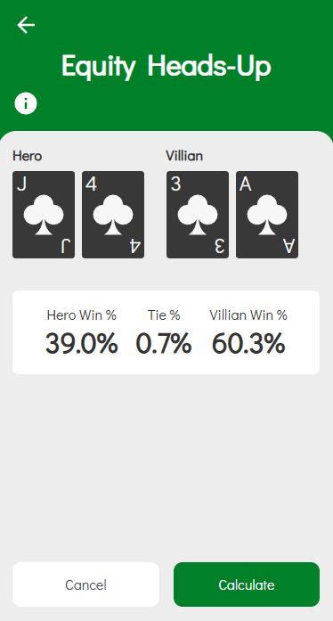

# Texas Hold'em Heads-Up Simulator

## Version v1.0.0 (2024/10/02)

## Introduction

**Author**: Hipkiss91
**Discord Server**: [MyLivePoker](https://discord.gg/qejnZwZ)

This project is a basic implementation of a Monte Carlo simulation to generate a percentage (%) likehood for winning a hand of Texes Holdem between two players. Defaults to `10,000` hands.

## Example



```js
import { run } from '~/utils/monteCarlo';

// Player 1's known hole cards: King of Clubs, Jack of Spades
const player1Cards = ['Kc', 'Js',];
// Player 2's known hole cards: Queen of Diamonds, Queen of Spades
const player2Cards = ['Qd', 'Qs',];

const {
    player1WinPercentage,
    player2WinPercentage,
    tiePercentage,
    error,
} = await run(
    player1Cards,
    player2Cards,
    10000
);

if (!error) {
    console.log(`Player 1 Win Percentage: ${player1WinPercentage}%`);
    console.log(`Player 2 Win Percentage: ${player2WinPercentage}%`);
    console.log(`Tie Percentage: ${tiePercentage}%`);
}
```

## Roadmap

- Include dead cards
- Include community cards
- Increase to a maximum of 10 players
- Improve calculations to handle larger numbers of simulations
- Maybe build to use multiple threads

## Feature & Bug Reporting

Issues / imrpovements can be raised on [github](https://github.com/hipkiss91/texas-hold-em-heads-up).
